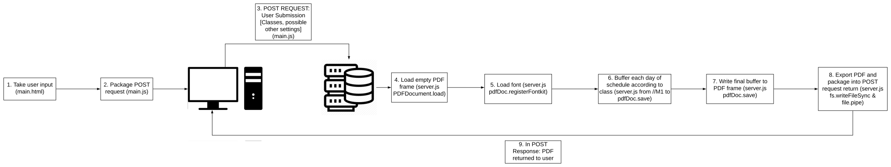

# -CPS-Schedule-Generator
CPS Schedule Generator is a full stack web application that allows [CPS](https://www.college-prep.org/) students to generate a customized version of their daily schedule within a few minutes. Users would input their classes in order (Block A, B, C, D, E, F, G) then hit "Submit". The program will return a printable PDF with the user's classes mapped to each block on the schedule. 

The implemented version of this program can be found [here](https://generator.rocketscience.monster).

# Implementation Technologies Breakdown

PDF Processing Server (Backend):
* Written in [Node.js](https://nodejs.org/en/), ran on the [Express](https://expressjs.com/) web framework. Code for the server is in [server.js](https://github.com/AirFusion45/-CPS-Schedule-Generator/blob/master/server.js).

Website & Submission Processing (Frontend):
* Written in [Javascript](https://developer.mozilla.org/en-US/docs/Learn/Getting_started_with_the_web/JavaScript_basics), can be hosted on any website hosting service. Code for this is in [main.js](https://github.com/AirFusion45/-CPS-Schedule-Generator/blob/master/main.js), [main.html](https://github.com/AirFusion45/-CPS-Schedule-Generator/blob/master/main.html) & [main.css](https://github.com/AirFusion45/-CPS-Schedule-Generator/blob/master/main.css).

# Building from source
Instructions on how to build CPS Schedule Generator from the source code.

### Building backend
* Prerequisites:
    * Computer with git enabled cli
    * A Node.js hosting service of your choice. Instructions are using Heroku.
    * A fully functioning website to host the frontend & basic knowledge with web hosting (cPanel, etc)
        
* Instructions:
    * Clone LTS version of the project using `git clone https://github.com/AirFusion45/-CPS-Schedule-Generator.git`
    * Follow instructions from your hosting service on deploying to their servers. [Here](https://devcenter.heroku.com/articles/preparing-a-codebase-for-heroku-deployment) are Heroku's instructions.
    * Grab your deployed app's URL
    * Go into `sever.js` and replace `https://blooming-tor-45007.herokuapp.com` with your deployed app's URL
    * Go into `main.html` and replace `https://blooming-tor-45007.herokuapp.com` with your deployed app's URL. Make sure that there is a `/` at the end of the URL. The replaced URL should look like this: `https://yourappsurl.hostingservice.com/` 
    
### Building frontend
* Instructions:
    * Presumably you have already cloned the project. 
    * Head to your website hosting provider. 
    * Open the file manager in cPanel.
    * Upload the `main.html`, `main.js` and `main.css` files to your website. Make sure the files are uploaded to the folder of your page/subpage. Also make sure that `.htaccess` has been modified to include `main.html`

# License
This projecet is licensed under MIT License - See the LICENSE.md file for more details. The main points of the MIT License are:
* This code can be used commercially
* This code can be modified
* This code can be distributed
* This code can be used for private use
* This code has no Liability
* This code has no Warranty
* When using this code, credit must be given to the author
        
# Authors
* AirFusion45 - Owner

# Contributions
* R Malik - Creator of the implemented website's favicon. See his creation [here](https://raw.githubusercontent.com/AirFusion45/-CPS-Schedule-Generator/master/favicon.png)

# Credits
* PDF modification library from Hopding's pdf-lib [here](https://github.com/Hopding/pdf-lib).
* Other side dependencies please see package.json

# Contact Me
If you find any bugs, license issues, missing credits, etc. Feel free to contact me by email or Discord!

* Please contact me here:
    * Email: jfang.cv.ca.us@gmail.com OR jim@jimfang.me
    * Discord: AirFusion#1706

# Note/Notes
* The latest stable version is the latest release in releases